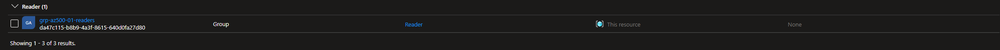
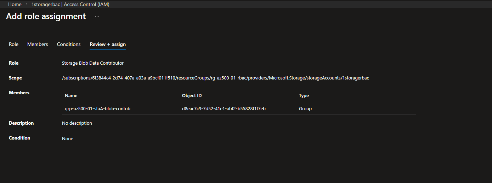
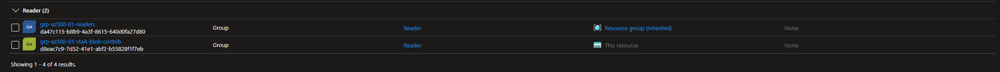
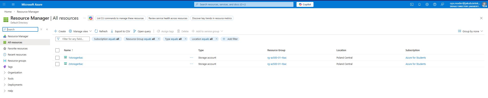
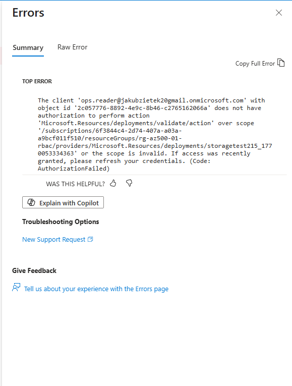
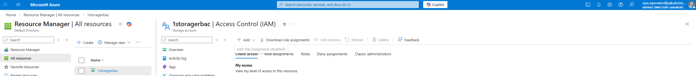

# Lab 01 — Azure RBAC: Least Privilege & Scope Design

## Goal

This lab demonstrates the design and validation of **least-privilege access control** in Microsoft Azure using **role-based access control (RBAC)**.

The focus is not on resource creation, but on:
- correct **scope selection**
- **group-based** access management
- separation of **management plane** and **data plane** permissions
- validation through **allowed and denied actions**

---

## Scenario

Two workloads (**App A** and **App B**) are deployed within the same resource group.

Operational requirements:
- Operations staff require **read-only visibility** across the environment.
- Operators must be able to **write blob data only to App A’s storage**.
- Operators must **not**:
  - modify infrastructure
  - assign permissions
  - access App B’s data

Security requirements:
- least privilege
- minimal blast radius
- no unnecessary resource enumeration

---

## Threats mitigated

- Excessive permissions / privilege creep  
- Accidental or malicious resource modification  
- Lack of accountability at scope boundaries  

---

## Architecture

- **1 Resource Group**
- **2 Storage Accounts**
  - Storage A → App A
  - Storage B → App B
- **2 Users**
  - `ops.reader`
  - `ops.operator`
- **2 Entra ID Security Groups**
  - `grp-az500-01-readers`
  - `grp-az500-01-staA-blob-contrib`

All resources were deployed in a **policy-allowed region**, reflecting real-world governance constraints.

---

## Implementation steps

1. Create a dedicated resource group for the lab.
2. Create two storage accounts within the same resource group.
3. Create Entra ID users and security groups.
4. Assign **built-in RBAC roles** to groups at the appropriate scopes:
   - Resource Group scope for read-only visibility
   - Resource scope for data access
5. Validate access boundaries using interactive sign-in.

---

## Validation

### RBAC assignments (evidence)

**Resource Group – Reader access (group-based)**  

**Storage A – Data-plane write access**  

**Storage A – Management-plane visibility**  

---

### ops.reader validation

Expected behavior:
- ✅ Can view resources in the resource group
- ❌ Cannot create or modify resources

Observed results:

**Read-only visibility across the resource group**  

**Denied attempt to create a resource**  

---

### ops.operator validation

Expected behavior:
- ✅ Can create containers and upload blob data in **Storage A**
- ❌ Cannot see or access **Storage B**
- ❌ Cannot modify IAM assignments

Observed results:

**Storage B not visible (deny-by-absence)**  

**Successful data operation on Storage A**  

**Denied attempt to assign roles**  

> Resources without assigned permissions are intentionally **not visible**, preventing unnecessary resource enumeration and reducing attack surface.

---

## Production notes

- RBAC assignments should be applied to **groups**, not individual users.
- Privileged roles should be combined with **Privileged Identity Management (PIM)**.
- Data-plane roles must be scoped as narrowly as possible to reduce blast radius.
- Subscription-wide roles for operational users should be avoided.
- Azure Policy should be used to enforce regional and governance constraints.

---

## Lessons learned

- Least privilege often results in **absence of visibility**, not explicit deny messages.
- Correct scope selection is more important than role selection alone.
- Management-plane and data-plane permissions must be treated separately.
- Validation through denied actions is essential to confirm access boundaries.

---

## Cleanup

All resources were removed by deleting the resource group after validation to maintain **cost and security hygiene**.
