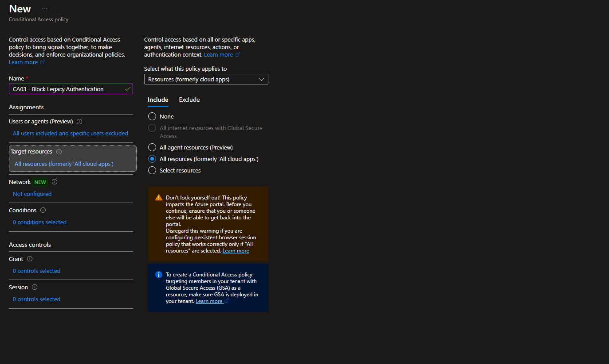
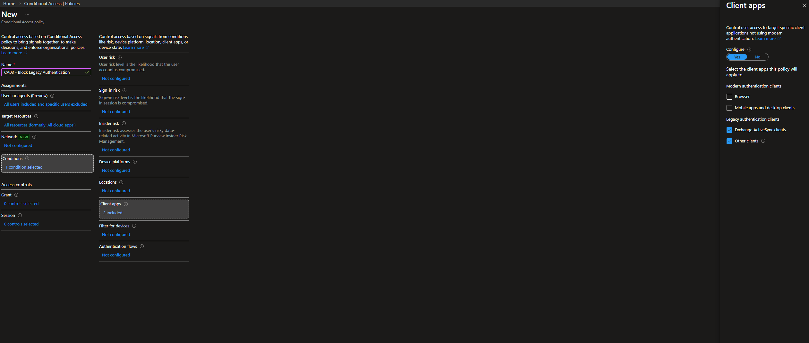
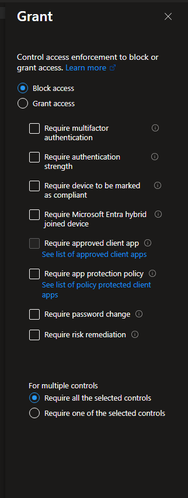

# Lab 03 — Conditional Access: Blocking Legacy Authentication

## Goal

This lab demonstrates **identity hardening in Microsoft Entra ID** by designing and deploying a Conditional Access policy that **blocks legacy authentication protocols at the tenant level**.

The objective is to demonstrate:

- correct Conditional Access policy scoping
- protocol-level access control
- reduction of identity attack surface
- safe tenant-wide policy deployment without lockout risk

This lab intentionally avoids MFA-based enforcement scenarios.  
In modern tenants, MFA is commonly enabled by default and does not reliably demonstrate **protocol-level Conditional Access behavior**. The focus here is on **eliminating entire legacy authentication paths**, not strengthening authentication challenges.

---

## Scenario

The tenant contains standard user accounts used for operational access to Microsoft cloud services.

**Security requirements:**

- legacy authentication protocols must be blocked
- modern authentication must remain unaffected
- the policy must be safe to deploy tenant-wide
- administrative recovery access must be preserved

---

## Threats Mitigated

- Password spray attacks targeting basic authentication endpoints
- Credential stuffing attacks bypassing MFA via legacy protocols
- Abuse of legacy mail and service authentication flows
- Automated attacks against non-OAuth authentication mechanisms

---

## Why This Control Still Matters

Despite modern authentication being the default, **legacy authentication remains enabled in many tenants for backward compatibility**.

Real-world identity incidents frequently involve:

- password spray campaigns against legacy endpoints
- forgotten or undocumented service accounts
- tenants relying on MFA while leaving legacy protocols unrestricted

Blocking legacy authentication removes **entire classes of identity attacks** without increasing user friction or operational overhead.

---

## Architecture

- **Users**
  - `ops.operator` (representative standard user)
  - break-glass administrative account (explicitly excluded)

- **Conditional Access policy**
  - targets legacy authentication client types
  - applies across all Microsoft cloud resources

- **No dependency on**
  - device compliance
  - Intune enrollment
  - MFA prompts
  - RBAC scope configuration

---

## Implementation

### Step 1 — Create Conditional Access Policy

Create a new Conditional Access policy with a clear, descriptive name.

---

### Step 2 — Assign Users

Include all users and explicitly exclude the break-glass administrative account to prevent tenant lockout.

---

### Step 3 — Target Cloud Applications

Target **all resources** (formerly “All cloud apps”) to ensure all legacy authentication attempts are evaluated.

---

### Step 4 — Configure Legacy Authentication Condition

Configure the policy to apply only to legacy authentication clients:

- Exchange ActiveSync clients  
- Other legacy clients  

Modern authentication clients are intentionally excluded to avoid impacting normal user workflows.

---

### Step 5 — Block Access

Configure the policy to **block access** when legacy authentication is detected.

No additional grant controls are required.

---

### Step 6 — Enable Policy

Set the policy state to **On** and save the configuration.

---

## Operational Validation

Blocking legacy authentication is a **preventive identity control**.

In a hardened tenant, legacy authentication traffic is expected to be **absent**.  
For this reason, the lab does not rely on generating artificial legacy sign-in attempts.

Policy effectiveness is validated through:

- Conditional Access policy configuration review
- Correct client app targeting
- Ongoing monitoring of sign-in logs (expected result: no legacy authentication events)

This reflects real-world identity operations, where preventive controls are validated through **design correctness and scope assurance**, not exploitation.

---

## Common Misconfigurations Avoided

- Blocking legacy authentication per application instead of tenant-wide
- Forgetting to exclude break-glass accounts
- Combining legacy authentication blocking with MFA unnecessarily
- Assuming Security Defaults fully disable legacy protocols
- Relying solely on sign-in logs instead of configuration review

---

## Production Notes

- Blocking legacy authentication is a baseline identity security control
- Policies should be applied tenant-wide
- Break-glass accounts must always be excluded
- This control significantly reduces credential-based attack surface
- No user experience impact when modern authentication is in use

---

## Lessons Learned

- Conditional Access is most effective when enforcing protocol-level restrictions
- MFA alone does not protect against legacy authentication abuse
- Legacy authentication remains a critical identity risk despite reduced visibility
- Preventive security controls are validated through correct design and scoping
