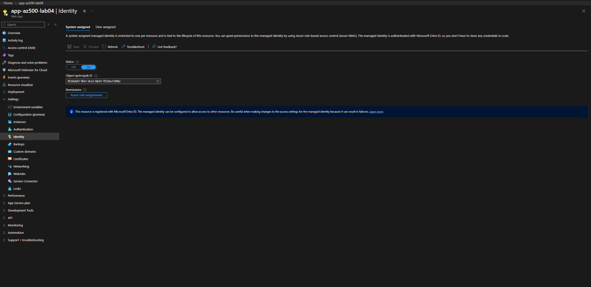
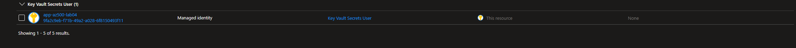
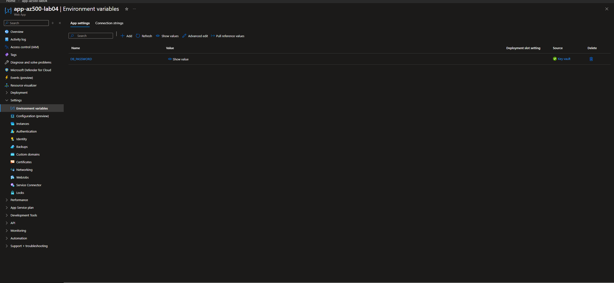
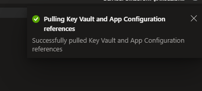
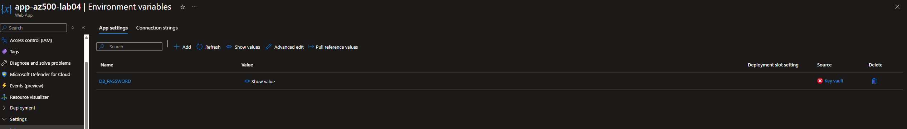
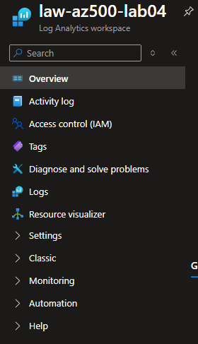

# Lab 04 — Azure Key Vault + Managed Identity: Secretsless Application Access

## Goal
This lab demonstrates a secure, production-aligned pattern for consuming application secrets in Microsoft Azure **without embedding credentials in code or configuration**.

The focus is on:
- identity-based access to secrets using managed identities
- data-plane authorization via Azure RBAC
- elimination of secret sprawl in application configuration
- validation through allowed and denied access tests
- auditability of secret access operations

---

## Scenario
An application (App A) requires access to a sensitive configuration value (e.g., a database password).

Operational constraints:
- The application must not store secrets in source code or configuration files.
- Secret access must be identity-based and centrally managed.
- Access must be revocable without redeploying the application.

Security requirements:
- no hardcoded or long-lived credentials
- least-privilege access to secrets
- separation of management-plane and data-plane permissions
- verifiable access boundaries

---

## Threats Mitigated
- Secret leakage via application configuration or environment variables
- Credential reuse across environments or workloads
- Excessive permissions on secret stores
- Undetected secret access due to lack of audit logging

---

## Architecture
- Azure App Service (App A)
- System-assigned managed identity
- Azure Key Vault using Azure RBAC permission model
- One secret stored in Key Vault
- Optional diagnostic logs sent to Log Analytics

---

## Implementation Steps

### 1. Enable Managed Identity on the Web App
A system-assigned managed identity was enabled on the Azure App Service.  
This identity is later used to authenticate to Key Vault without credentials.

---

### 2. Grant Least-Privilege Access to Key Vault
The App Service managed identity was granted **read-only secret access** using Azure RBAC.

- Role assigned: `Key Vault Secrets User`
- Scope: Key Vault
- No administrative, key, or certificate permissions granted

---

### 3. Store the Secret in Azure Key Vault
A secret was created in Azure Key Vault to simulate sensitive application configuration
(e.g., database password). The secret value itself is never exposed in application settings.

---

### 4. Configure Application to Use Key Vault Reference
The application was configured to consume the secret via a Key Vault reference:

@Microsoft.KeyVault(SecretUri=<secret-uri>)

This ensures the secret is resolved at runtime using the managed identity.

---

## Validation

### Positive Validation — Secret Resolution
The application successfully resolved the Key Vault reference using its managed identity.

Validation method:
- App Service configuration was refreshed using **Pull reference values**
- Azure confirmed successful resolution of Key Vault references

Expected behavior:
- Secret is resolved dynamically
- No plaintext secret is stored in configuration

Observed result:
- Reference resolution succeeded

---

### Negative Validation — Access Revocation
To validate enforcement of least privilege, access was intentionally revoked.

Test performed:
- The `Key Vault Secrets User` role assignment was removed from the managed identity

Expected behavior:
- Secret resolution should fail immediately

Observed result:
- Key Vault reference resolution failed due to insufficient permissions

Access was restored by re-assigning the role, confirming identity-based enforcement.

---

## Audit and Monitoring (Optional)

### Log Analytics Workspace
A Log Analytics workspace was created to collect Key Vault audit logs.

---

### Key Vault Diagnostic Settings
Key Vault diagnostic logs were enabled and forwarded to Log Analytics, allowing
audit and investigation of secret access events.

---

## Security Control Mapping

| Security Objective | Control Implemented | Validation |
|------------------|-------------------|-----------|
| Eliminate embedded secrets | Managed identity + Key Vault reference | No plaintext secrets in config |
| Least privilege | `Key Vault Secrets User` role | Access denied on role removal |
| Access revocation | Azure RBAC | Immediate failure without redeploy |
| Auditability | Key Vault diagnostic logs | Logs available in Log Analytics |

---

## Production Notes
- Managed identities should be preferred over service principals with secrets.
- Azure RBAC provides clearer separation of duties than Key Vault access policies.
- Secret versioning enables rotation without application changes.
- Diagnostic logs should be retained according to incident response requirements.

---

## Lessons Learned
- Azure Key Vault using RBAC does not grant implicit data-plane access to resource owners.
- Secret access must be explicitly assigned, reinforcing least-privilege design.
- RBAC-based revocation is immediate and effective.
- Validation through denied access is essential to confirm security boundaries.

---

## Cleanup
All resources created for this lab can be safely removed by deleting the associated
resource group to avoid unnecessary cost.
