# Lab 05 — Azure Storage Network Isolation with Firewall, Bastion, and Private Endpoint

## Overview

This lab demonstrates **enterprise-grade network isolation of Azure Storage** using defense-in-depth controls.  
The objective is to ensure that blob data is **not reachable from the public internet**, even if credentials are compromised, and that **all access paths are explicitly controlled and validated**.

The lab combines:
- Network segmentation
- Private Endpoints
- Forced egress via Azure Firewall
- Bastion-based administrative access
- Layer 7 outbound allowlisting

The implementation reflects real-world Azure security architectures used in regulated and high-security environments.

---

## Goals

- Enforce **network-level isolation** for Azure Storage
- Eliminate public data-plane access
- Restrict administrative access to private connectivity only
- Centralize outbound traffic control
- Validate both **allowed** and **denied** access paths

---

## Architecture Summary

**Region:** North Switzerland (chosen due to student subscription compute quotas)

### Core Components
- Virtual Network with segmented subnets
- Azure Firewall (Standard)
- Azure Bastion
- Virtual Machine (no public IP)
- Azure Storage Account (Blob)
- Private Endpoint + Private DNS
- User-Defined Routes (UDR)

### High-level Flow
- Workload VM has no public exposure
- All outbound traffic is routed through Azure Firewall
- Storage Account is accessible **only via Private Endpoint**
- Public network access to Storage is disabled
- Bastion provides secure administrative access
- Firewall enforces Layer 7 outbound allowlisting

---

## Network Design

| Subnet | Purpose |
|------|--------|
| `AzureFirewallSubnet` | Azure Firewall |
| `AzureBastionSubnet` | Bastion |
| `snet-workload` | VM workload |
| `snet-private-endpoints` | Private Endpoints |

---

## Implementation

### 1. Azure Firewall Deployment

Azure Firewall (Standard) was deployed into a dedicated subnet to act as a centralized egress control point.

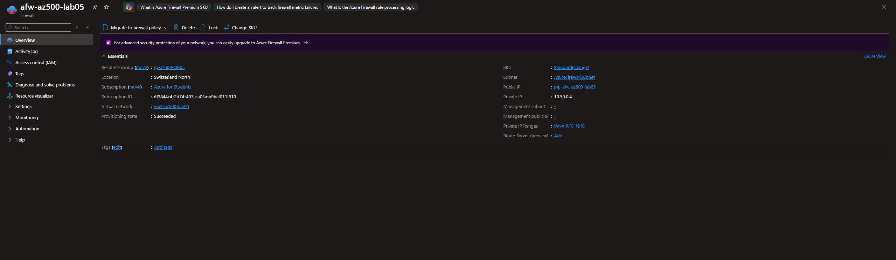

---

### 2. Forced Egress via User-Defined Routes

A route table was created to force all outbound traffic (`0.0.0.0/0`) from the workload subnet through the Azure Firewall.

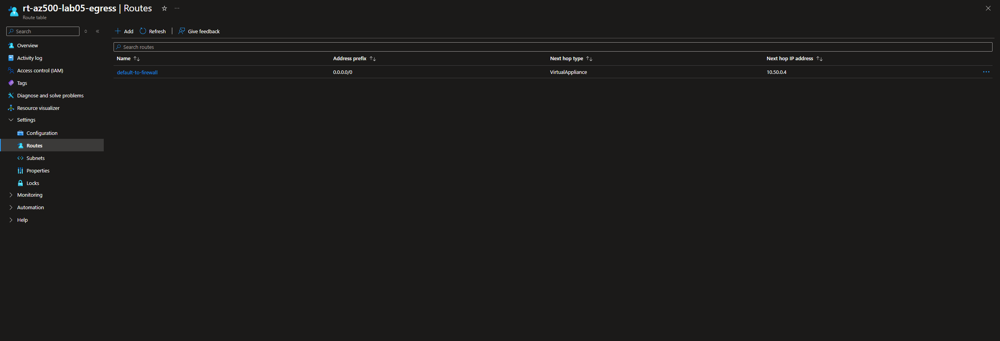

The route table was explicitly associated with the workload subnet.

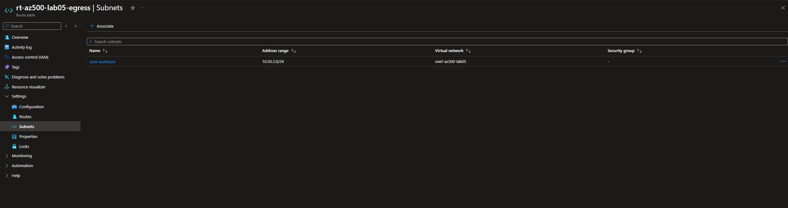

---

### 3. Secure Administrative Access with Bastion

Azure Bastion was deployed to provide browser-based SSH access without assigning public IPs to virtual machines.

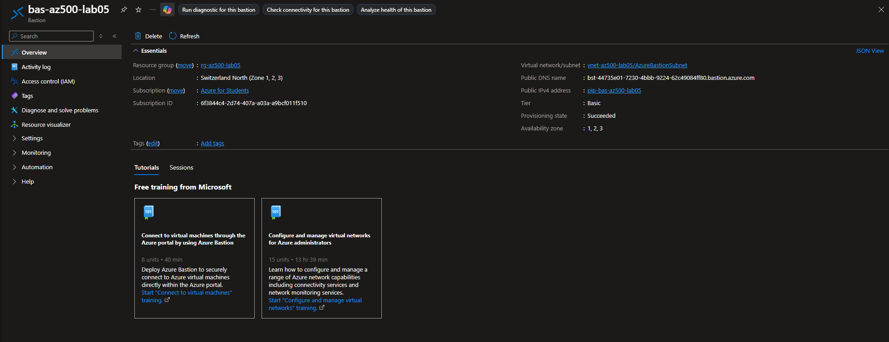

Connection to the VM is performed exclusively via Bastion.

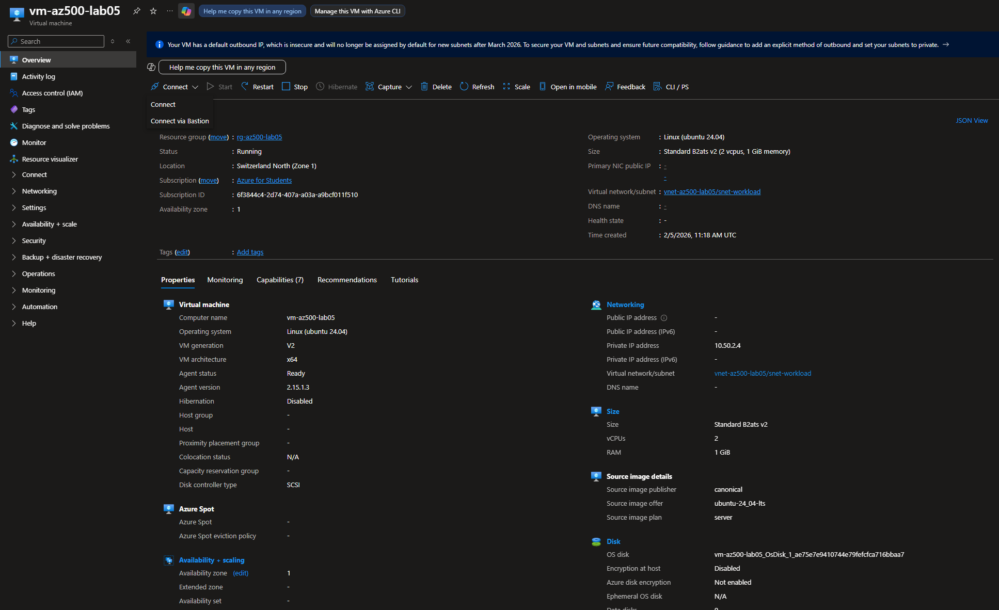

---

### 4. Storage Account Network Hardening

Public network access to the Storage Account was explicitly disabled, enforcing private connectivity only.

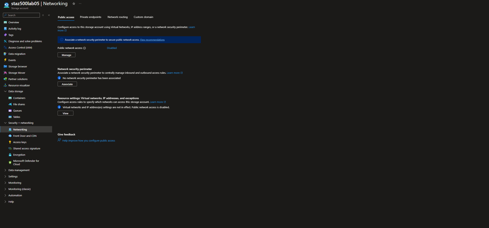

---

### 5. Private Endpoint for Blob Access

A Private Endpoint was created for the Blob service and integrated with Private DNS to ensure name resolution to a private IP.

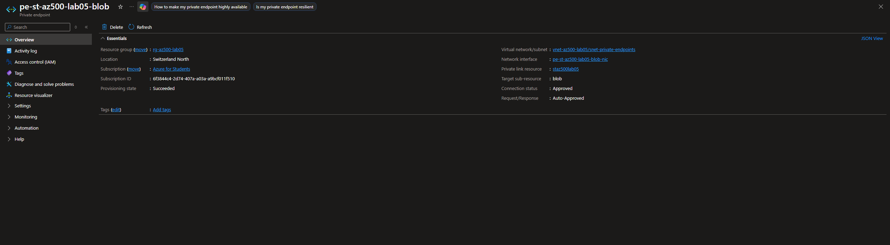

---

## Validation

### Validation 1 — Public Access Denied

Attempting to access the storage container from outside the virtual network results in denied access, confirming that public data-plane exposure is eliminated.

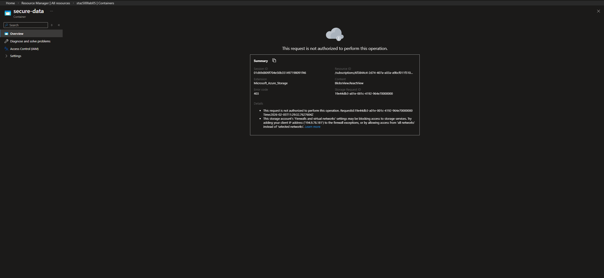

---

### Validation 2 — Private Access Allowed

From the workload VM (accessed via Bastion):

- DNS resolution of the storage account returns a **private IP**
- HTTPS connectivity to the Blob service succeeds

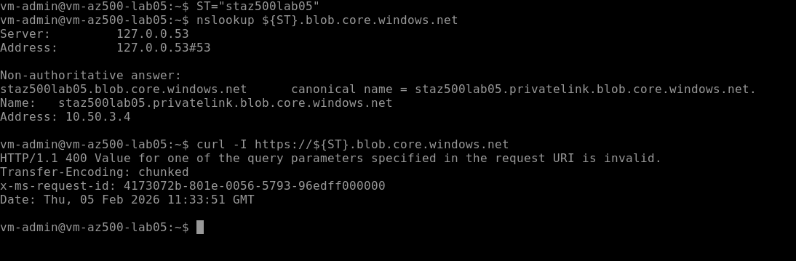

This confirms that access is possible **only** from inside the trusted network boundary.

---

### Validation 3 — Firewall Application Rule Enforcement

An Azure Firewall **Application Rule** was configured to allow outbound HTTPS traffic **only** to Microsoft-owned domains.

#### Allowed Destination
- `https://www.microsoft.com` → allowed

#### Blocked Destination
- `https://www.google.com` → blocked

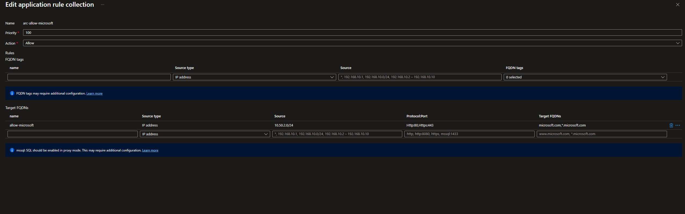

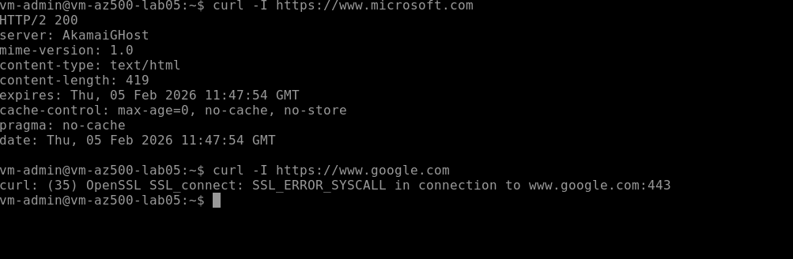

This validates centralized Layer 7 outbound control and implicit deny behavior.

---

## Security Outcomes

- No public IPs on workloads
- No public access to Storage data-plane
- Explicit private connectivity via Private Endpoint
- Centralized egress inspection and control
- Bastion-only administrative access
- Defense-in-depth across identity, network, and data layers

---

## Lessons Learned

- Network isolation is a critical complement to identity-based access control
- Private Endpoints effectively eliminate public attack surface for PaaS services
- Azure Firewall enables enforceable outbound control and data exfiltration prevention
- Bastion removes the need for inbound administrative exposure
- Cloud architecture must adapt to regional quota constraints without compromising security

---

## Notes

- Resources were deployed temporarily and removed after validation to control cost
- The architecture aligns with enterprise Azure landing zone patterns
- The lab intentionally prioritizes **security signal over resource sprawl**
