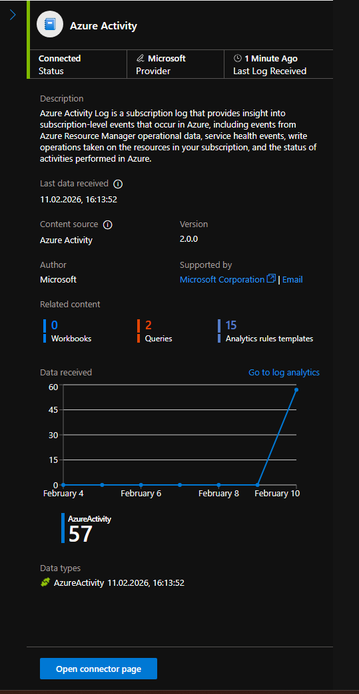
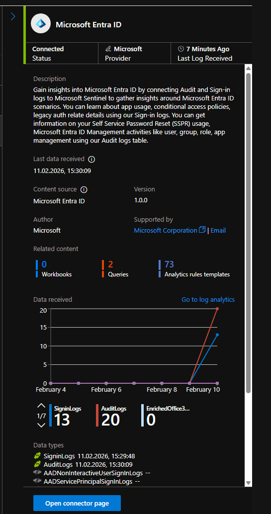
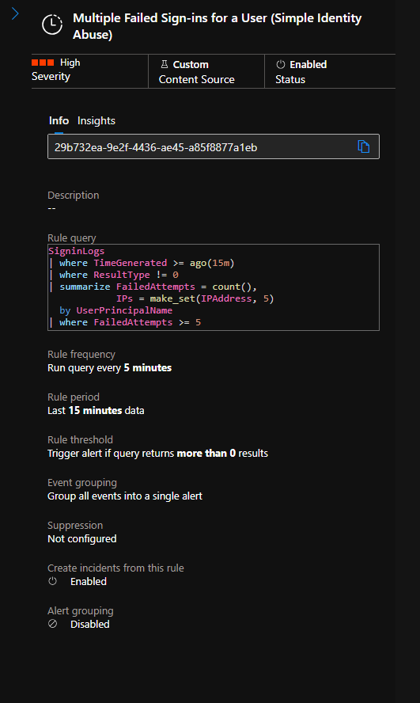
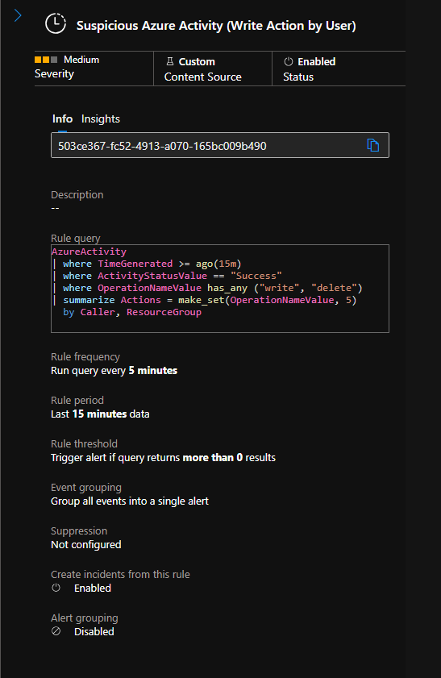
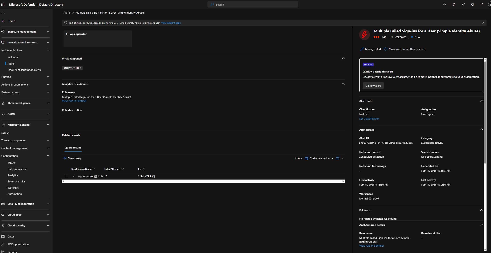
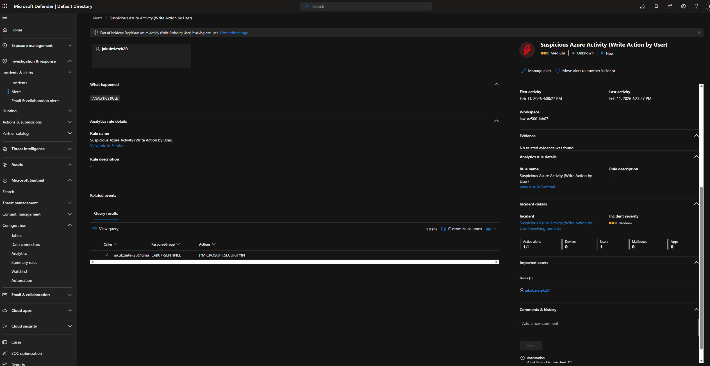
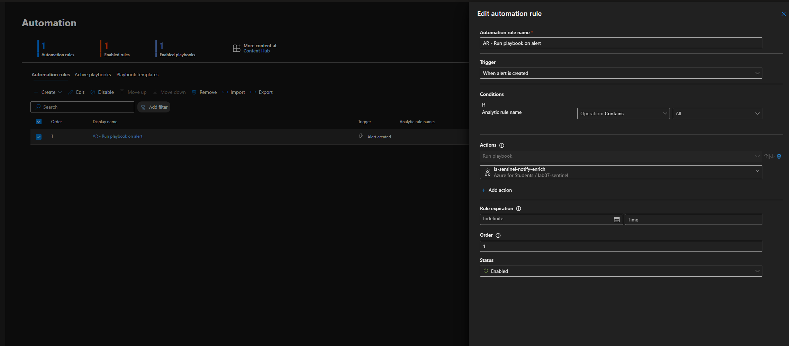
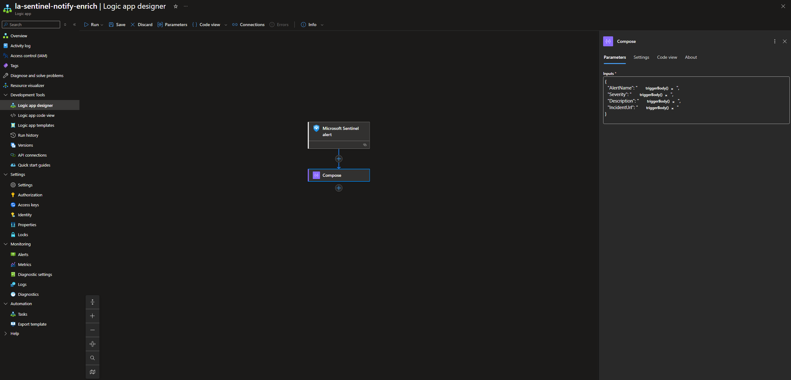
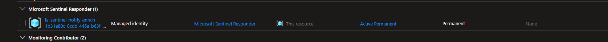
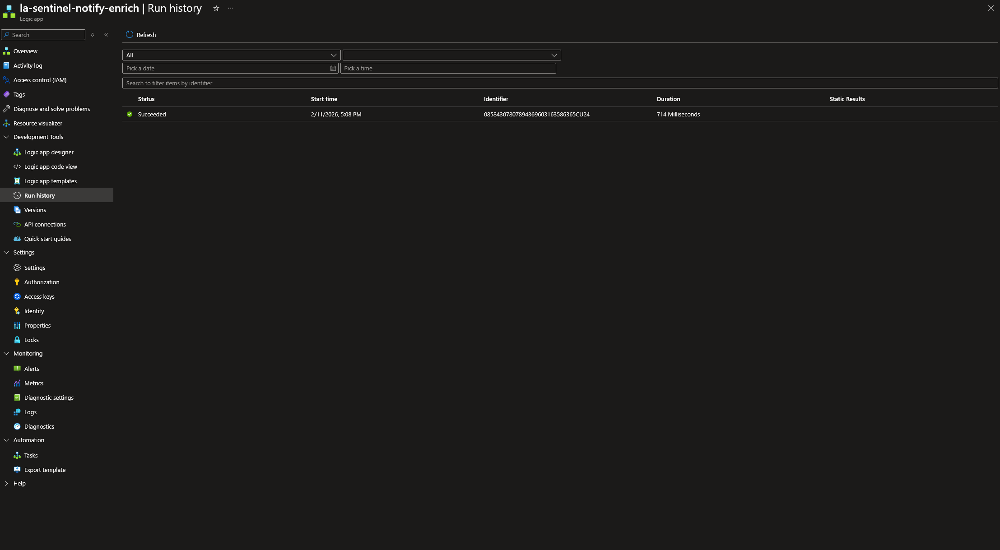

# Lab 07 — Microsoft Sentinel: Detection Engineering + Automated Response (Logic App)

## Overview

This lab demonstrates end-to-end detection and response in **Microsoft Sentinel** using:

- **Microsoft Entra ID logs** (Sign-in logs, Audit logs)
- **Azure Activity logs**
- **Two custom analytic rules** written in **KQL**
- A **Sentinel Automation Rule** that triggers a **Logic App playbook**
- Secure permissions using **managed identity** and **least-privilege role assignment**

The objective is to show practical baseline detections that are:

- Easy to validate in a lab tenant
- Built on common enterprise log sources
- Designed with SOC-friendly output (entities, enrichment fields)
- Automated to reduce manual response overhead

---

## Goals

- Ingest identity and control-plane telemetry into Sentinel
- Build two custom analytic rules with correct KQL and clear intent
- Generate “test” activity so alerts actually fire
- Create an automation rule that runs a Logic App playbook on alert creation
- Validate the playbook execution via run history
- Keep implementation **low/no cost** and reproducible in **Azure for Students**

---

## Architecture Summary

### Data Sources

| Source | Connector | Primary Tables |
|---|---|---|
| Microsoft Entra ID | Microsoft Entra ID | `SigninLogs`, `AuditLogs` |
| Azure Subscription | Azure Activity | `AzureActivity` |

### Response Automation

| Component | Purpose |
|---|---|
| Automation Rule | Runs playbook when alert is created |
| Logic App (Playbook) | Notify/enrich alert context (structured payload) |
| Managed Identity | Secure auth for playbook without secrets |

---

## Data Connectors

### Azure Activity

Connector status verified as **Connected** and receiving logs.



### Microsoft Entra ID

Connector status verified as **Connected** and receiving logs.



---

## Detection Rules

Two custom analytics rules were implemented: one identity-focused and one Azure control-plane focused.





---

### Rule 1 — Multiple Failed Sign-ins for a User

#### Detection Objective

Detect repeated failed sign-in attempts for a single user within a short time window (baseline identity abuse signal).

#### KQL Query

```kql
SigninLogs
| where TimeGenerated >= ago(15m)
| where ResultType != 0
| summarize FailedAttempts = count(),
            IPs = make_set(IPAddress, 5)
  by UserPrincipalName
| where FailedAttempts >= 5
```
#### Rule configuration highlights

- Run query every **5 minutes**
- Look back **15 minutes**
- Alert when query returns **> 0** results
- **Incident creation enabled**

---

### Rule 2 — Suspicious Azure Activity (Write/Delete Actions)

#### Detection Objective

Detect successful Azure control-plane operations that modify or delete resources within a short window (baseline administrative activity signal).

#### KQL Query

```kql
AzureActivity
| where TimeGenerated >= ago(15m)
| where ActivityStatusValue == "Success"
| where OperationNameValue has_any ("write", "delete")
| summarize Actions = make_set(OperationNameValue, 5)
  by Caller, ResourceGroup
```
#### Rule configuration highlights

- Run query every **5 minutes**
- Look back **15 minutes**
- Alert when query returns **> 0** results
- **Incident creation enabled**

---

## Validation

Validation was performed by generating activity that reliably produces telemetry in the connected tables.

### Validation 1 — Failed Sign-in Alert Fired

**Result:**

- Alert generated from failed sign-in attempts
- Confirms ingestion from `SigninLogs` and correct threshold logic



### Validation 2 — Azure Activity Alert Fired

**Result:**

- Alert generated from a successful write/delete-style operation
- Confirms ingestion from `AzureActivity` and correct operator matching


---

## Automation

Automation was implemented using a Sentinel **Automation Rule** which triggers a Logic App playbook on alert creation.

### Automation Rule

Configured to run playbook when **any alert is created**.



### Logic App Playbook

A Logic App playbook was created to process Sentinel alert payload and generate a structured enrichment object using **Compose**.



### Playbook Permissions (Managed Identity)

The Logic App uses a **managed identity** with Sentinel permissions assigned.



### Playbook Execution Validation

The playbook executed successfully as confirmed in run history.



---

## Tuning Considerations

Thresholds should be environment-specific:

- **Identity detection:** adjust `FailedAttempts` based on typical auth noise (MFA prompts, conditional access retries, service account failures)
- **Control-plane detection:** filter out known automation identities (CI/CD, IaC pipelines), and consider scoping to sensitive resource groups
- Consider adding **suppression windows** to prevent alert storms during maintenance
- Add exclusions for known safe IP ranges (e.g., corporate VPN egress)
- Prefer grouping by additional fields if available (app name, user agent, location) to improve triage context

---

## Why These Detections

These two rules were selected because they represent real baseline SOC signals that are widely deployed:

- Identity abuse signals are among the most common first indicators of compromise in cloud-first tenants
- Azure write/delete activity is a high-impact control-plane signal that can indicate persistence, sabotage, or privilege misuse

They are also lab-friendly: both can be validated using normal tenant behavior without advanced licensing requirements.

---

## What Would Be Next in Production

- Route playbook output to Teams/email/ITSM (ServiceNow/Jira) with standard incident templates
- Add enrichment steps:
  - Geo-IP lookups
  - Threat intel checks for source IP
  - Caller identity enrichment (role membership, recent privilege changes)
- Implement containment actions (documented or automated):
  - Disable user / revoke sessions
  - Require MFA re-registration
  - Lock sensitive resource groups / apply deny assignments temporarily
- Create dashboards/workbooks for identity and control-plane monitoring
- Use watchlists for known admin users, automation identities, and approved IP ranges

---

## Notes

- Lab designed to work under **Azure for Students** with minimal cost
- Automation uses **managed identity** to avoid secrets and credential storage
- Resources can be removed after validation to control cost
